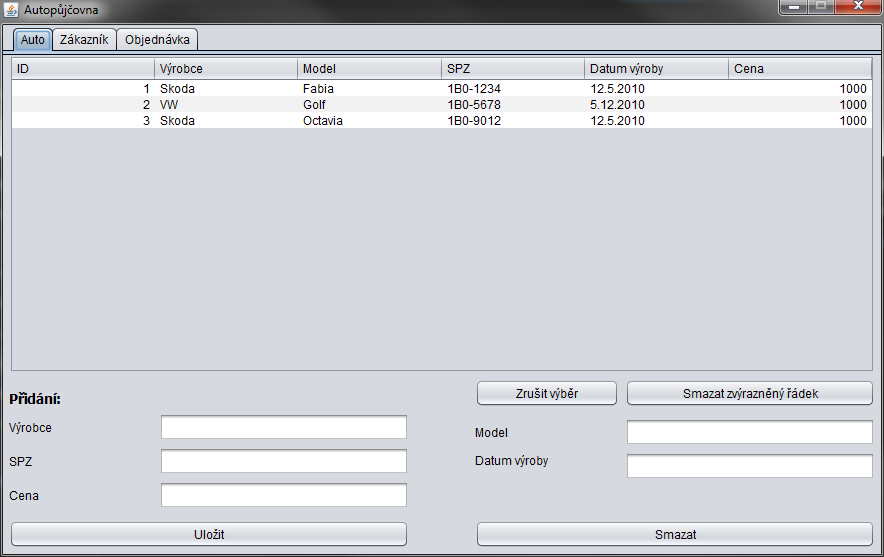

# Rental Shop

Java application for managing car rentals. Cars and customers are stored in the internal Derby database. Design of the application is rendered by Java Swing framework.

## Usage
Download the archive with application from [here](https://github.com/hermajan/RentalShop/releases/latest) and extract it. Then run the `RentalShop.jar` file.

